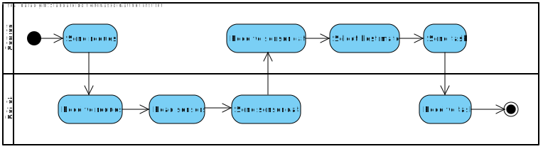

### Beschreibung zu Prozess-ID: Name des Geschäftsprozesses

#### Beschreibung zu 1: choose Robot

|   |   |
|---|---|
| **Auslösendes Ereignis:** | Der Server will den für ein bestimmtes Ziel bestmöglichen Roboter auswählen und diesen zum Ziel schicken. |
| **Ergebnis:**             | Alle Roboter haben ihre Sensordaten ausgelesen und diese dem Server mitgeteilt. Daraufhin hat der Server einen Roboter ausgewählt, der für die Zielanfahrung optimal geeignet ist, und diesem den Auftrag zum Anfahren des Ziels übermittelt. |
| **Mitwirkende:**          | Server, Roboter |

Um den für ein gegebenes Ziel bestmöglichen Roboter auszuwählen, sendet der Server zunächst an alle Roboter eine Anfrage (*request*), woraufhin die Roboter ihre Sensordaten (*sensor data*) auslesen und an den Server senden. Auf Grundlage dieser Daten wählt der Server den Roboter aus, der für die Zielanfahrung optimal positioniert ist und sendet ihm die konkrete Aufforderung (*task*) zum Anfahren des Ziels. 

Wie die Sensordaten und der Algorithmus zur Wahl des optimalen Roboters konkret definiert sind, ist eine Entwurfsentscheidung, die zum Zeitpunkt dieser ersten Ausbaustufe noch nicht getroffen wurde.
