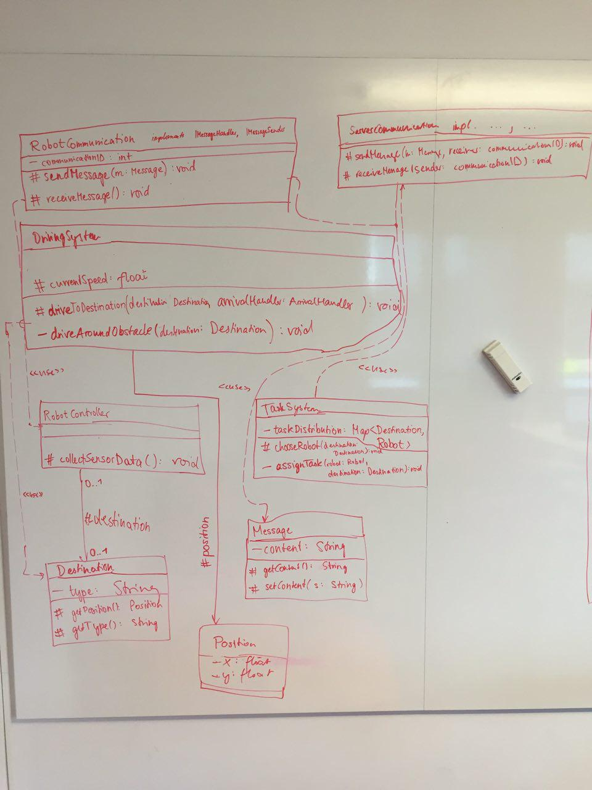

# Protokoll 13.05. (Gruppe C)
- Teilnehmende: __Sebastian__, __Jonathan__, __Bastian__
- Thema: _6. Paketstruktur_, _7. Paketdetails_
- _Deadline:_ Fertigstellung bis Mittwoch 9:15 Uhr (fertiges Dokument)

## Aufgabenverteilung:
- __Jonathan:__ Paketdiagramm, Robot-Methoden
- __Bastian:__ Robot-Klassendiagramm, Nachrichtenfluss
- __Sebastian:__ Server-Klassendiagramm, Server-Methoden

## _6. Paketstruktur_ – Modelliertes Paketdiagramm

## _7. Paketdetails_
### Klassendiagramm (unvollständig):

- To Do
    + Klassendiagramme ausfüllen (Attribute und Methoden in Paketdiagramm ergänzen)
    + jede von uns hinzugefügte Attribute und  Methode beschreiben

## Aufgekommene Fragen
- Können Server und Robot in der aktuellen Modellierung überhaupt miteinander kommunizieren?
	+ Wäre es vielleicht angebracht, sowohl Server als auch Robot das Communication-Paket per "access" nutzen zu lassen, um beide darüber kommunizieren zu lassen?
- Wann fährt Robot von Ladestation? Erst bei 100 % oder z.B. schon bei 70 %, wenn ein (wichtiger) Auftrag eingeht?
- Dürfen wir die aus Java verfügbare "Map" verwenden?
- Wie ist es mit den Beziehungen zwischen den Klassen im Klassendiagramm? Wann "use" (gestrichelte Linie), wann durchgezogene Linie mit Rollenname?
