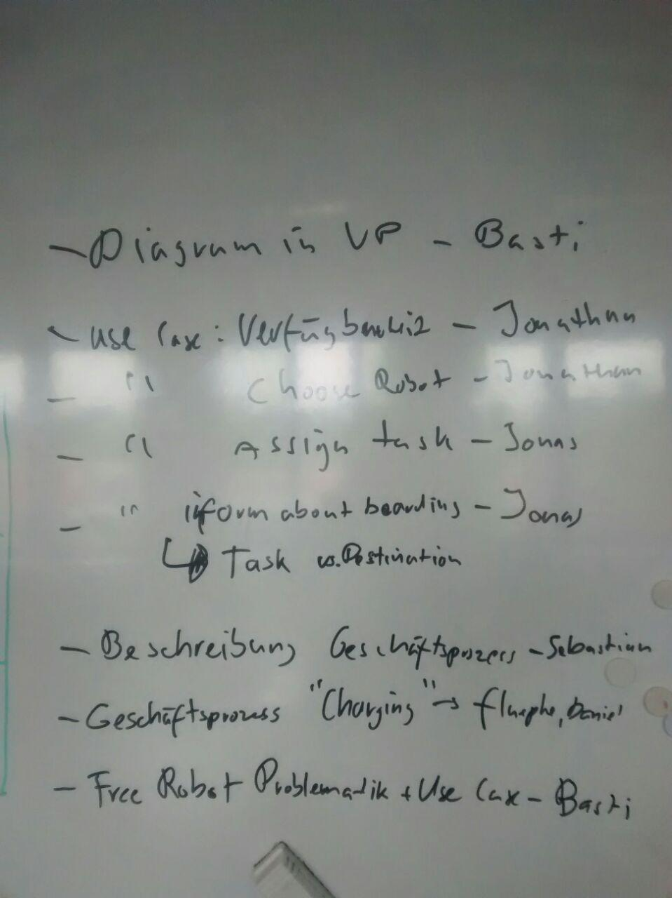
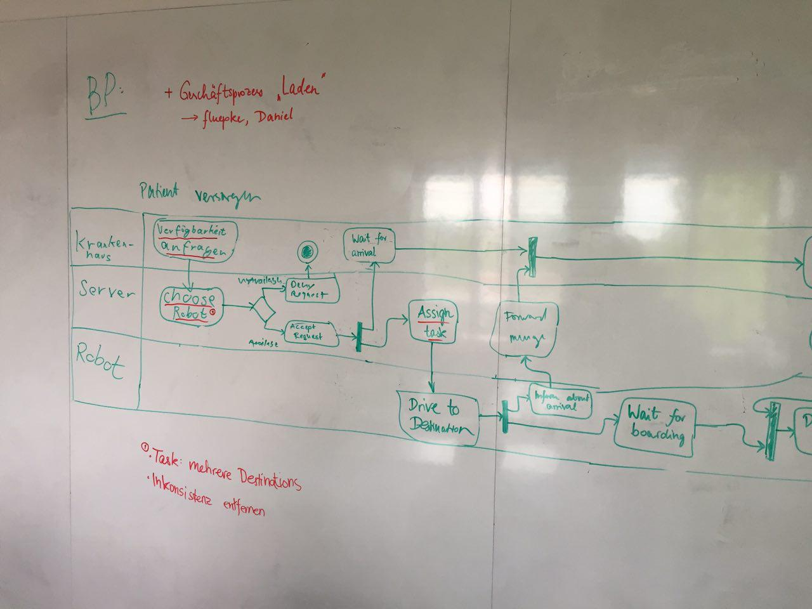
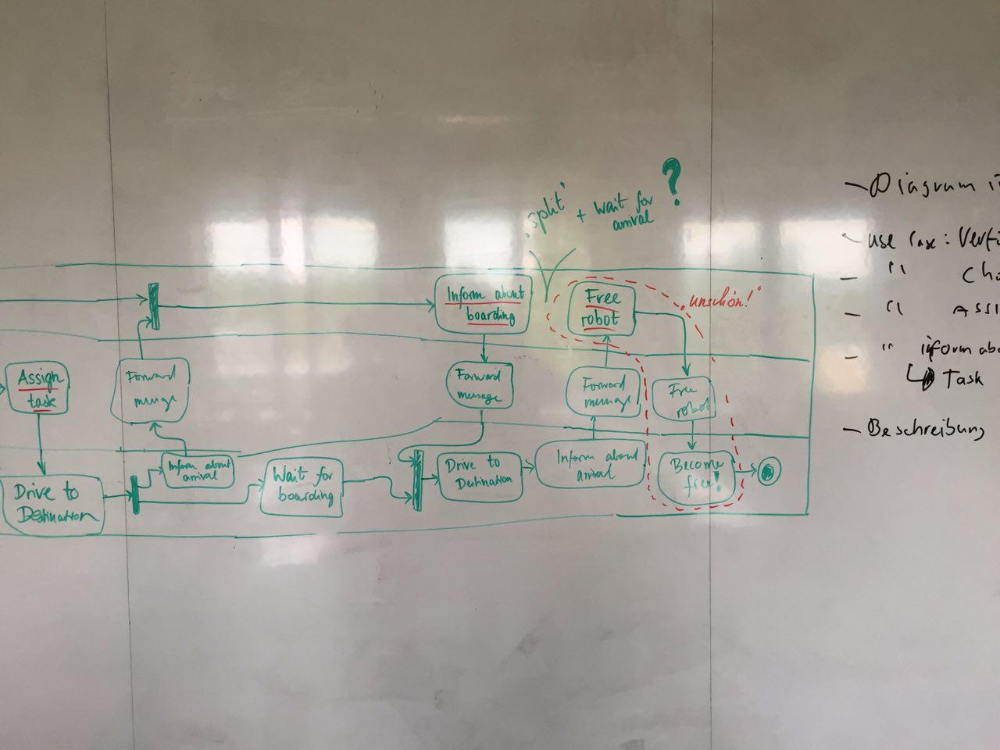

# Protokoll 26.05. (Kapitel 2.4, 3.1, 3.2)
- Abwesende Personen: __Fabian__ (entschuldigt), __Daniel__
- Thema: Geschäftsprozesse und Use Cases in 1. Ausbaustufe (Analyse)
- _Deadline:_ Fertigstellung bis Mittwoch 9:15 Uhr (fertiges Dokument)

## Aufgabenverteilung:

## Geschäftsprozess "Patient versorgen"

